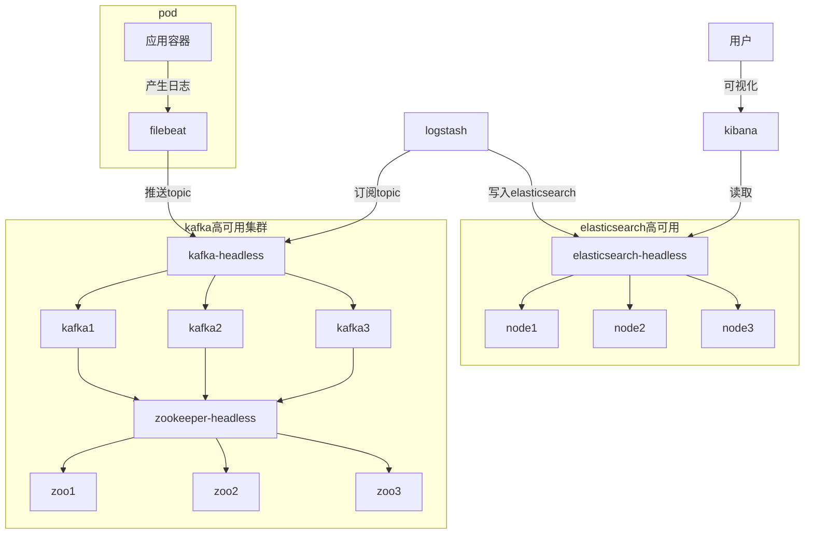

## EFK搭建(elasticsearch+kibana+zk&kafka+filebeat)

[TOC]

### 架构

#### EFK架构:

包含以下组件

- elasticsearch (Replica部署，部署3个节点)
- kibana(单点部署，部署一个)
- zk&kafka (高可用部署，两个集群都3个)
- logstash(单点部署，部署一个)
- filebeat (随着要收集的容器一同在一个pod启动)

#### 功能简介

主要提供一套收集工具，供filebeat收集日志，filebeat和目标容器一起在一个pod中运行，对于需要收集日志的路径,采用emptyDir方式挂载到filebeat的路径，然后编写filebeat规则，让filebeat把日志推送到kafka集群的一个topic，logstash再订阅该topic,并且把数据经过处理后发给elasticssearch存储，用户端可以通过kibana对elasticsearch存储的数据进行可视化


#### 架构图




### 准备工作

	这里的ELK部署采用kubernetes 的helm+定制values.yaml

#### 把elastic的 helm-charts下载回来

```bash
cd /data/install_k8s/plugin/efk
git clone https://github.com/elastic/helm-charts.git
```

EFK需要用的组件放在: `/data/install_k8s/plugin/efk`

### Elasticsearch

> 部署到master

	elasticsearch 在这个helm中采用了有状态副本集管理方法，每个pod将会是一个master和data node，然后通过charts那边的状态集自动决定ES的容器的生命周期
	
	elasticsearch将会部署3个节点
	
	数据卷：采用本地卷的形式，通过配置values.yaml 把pv配置进去

`/data/install_k8s/plugin/efk/elasticsearch-741-values.yaml`

```yaml
---
#集群名字
clusterName: "efk"
nodeGroup: "master"

masterService: ""

# Elasticsearch roles that will be applied to this nodeGroup
# These will be set as environment variables. E.g. node.master=true
roles:
  master: "true"
  ingest: "true"
  data: "true"

#要部署多少个副本
replicas: 3
#最小可容忍节点数
minimumMasterNodes: 2


#注入es的配置文件
esConfig:
  elasticsearch.yml: |
    http.cors.enabled: "true" 
    http.cors.allow-origin: "*" 

image: "elasticsearch"
imageTag: "7.4.1"
imagePullPolicy: "IfNotPresent"

podAnnotations: {}
  # iam.amazonaws.com/role: es-cluster

# additionals labels
labels: {}

esJavaOpts: "-Xmx1g -Xms1g"

resources:
  requests:
    cpu: "100m"
    memory: "2Gi"
  limits:
    cpu: "1000m"
    memory: "2Gi"

networkHost: "0.0.0.0"

#本地卷
volumeClaimTemplate:
  accessModes: [ "ReadWriteOnce" ]
  storageClassName: "master-disks"
  resources:
    requests:
      storage: 40Gi

rbac:
  create: false
  serviceAccountName: ""

podSecurityPolicy:
  create: false
  name: ""
  spec:
    privileged: true
    fsGroup:
      rule: RunAsAny
    runAsUser:
      rule: RunAsAny
    seLinux:
      rule: RunAsAny
    supplementalGroups:
      rule: RunAsAny
    volumes:
      - secret
      - configMap
      - persistentVolumeClaim

persistence:
  enabled: true
  annotations: {}

priorityClassName: ""

antiAffinityTopologyKey: "kubernetes.io/hostname"
antiAffinity: "hard"

podManagementPolicy: "Parallel"

protocol: http
httpPort: 9200
transportPort: 9300

service:
  labels: {}
  labelsHeadless: {}
  type: ClusterIP
  nodePort: ""
  annotations: {}
  httpPortName: http
  transportPortName: transport

updateStrategy: RollingUpdate

maxUnavailable: 1

podSecurityContext:
  fsGroup: 1000
  runAsUser: 1000

fsGroup: ""

securityContext:
  capabilities:
    drop:
    - ALL
  # readOnlyRootFilesystem: true
  runAsNonRoot: true
  runAsUser: 1000

# 平滑关闭 120s
terminationGracePeriod: 120

sysctlVmMaxMapCount: 262144

readinessProbe:
  failureThreshold: 3
  initialDelaySeconds: 10
  periodSeconds: 10
  successThreshold: 3
  timeoutSeconds: 5

# https://www.elastic.co/guide/en/elasticsearch/reference/current/cluster-health.html#request-params wait_for_status
clusterHealthCheckParams: "wait_for_status=green&timeout=1s"

## Use an alternate scheduler.
## ref: https://kubernetes.io/docs/tasks/administer-cluster/configure-multiple-schedulers/
##
schedulerName: ""

imagePullSecrets: []
#部署在master节点
nodeSelector:
  node-role.kubernetes.io/master: ""

tolerations:
  - key: "node-role.kubernetes.io/master"
    effect: "NoSchedule"

# Enabling this will publically expose your Elasticsearch instance.
# Only enable this if you have security enabled on your cluster
ingress:
  enabled: false
 
nameOverride: ""
fullnameOverride: ""

# https://github.com/elastic/helm-charts/issues/63
masterTerminationFix: false

lifecycle: {}

sysctlInitContainer:
  enabled: true
```


#### 运维命令

```bash
#第一次部署命令
helm install --name efk-elasticsearch ./helm-charts/elasticsearch --values elasticsearch-741-values.yaml --namespace efk

#如果中途更新了values.yaml，通过下面命令滚动更新
helm upgrade efk-elasticsearch ./helm-charts/elasticsearch --values elasticsearch-741-values.yaml --namespace efk

#完全卸载
helm delete --purge efk-elasticsearch
#删除后还得把pvc删除，pvc删除后pv会自动释放，变为可用状态
```


### Kibana

> 部署到node

`/data/install_k8s/plugin/efk/kibana-741-values.yaml`

```yaml
---

elasticsearchURL: ""
#与上面的生成的svc无头服务有关，可以get svc -n monitoring查询到
elasticsearchHosts: "http://efk-elasticsearch-headless:9200"

replicas: 1

# Extra environment variables to append to this nodeGroup
# This will be appended to the current 'env:' key. You can use any of the kubernetes env
# syntax here
extraEnvs: []
#  - name: MY_ENVIRONMENT_VAR
#    value: the_value_goes_here

# A list of secrets and their paths to mount inside the pod
# This is useful for mounting certificates for security and for mounting
# the X-Pack license
secretMounts: []
#  - name: kibana-keystore
#    secretName: kibana-keystore
#    path: /usr/share/kibana/data/kibana.keystore
#    subPath: kibana.keystore # optional

image: "kibana"
imageTag: "7.4.1"
imagePullPolicy: "IfNotPresent"

# additionals labels
labels: {}

podAnnotations: {}
  # iam.amazonaws.com/role: es-cluster

resources:
  requests:
    cpu: "100m"
    memory: "500Mi"
  limits:
    cpu: "1000m"
    memory: "1Gi"

protocol: http

serverHost: "0.0.0.0"

healthCheckPath: "/app/kibana"

# 注入配置文件
kibanaConfig: 
  kibana.yml: |
    i18n.locale: zh-CN   # 设置成中文

podSecurityContext:
  fsGroup: 1000

securityContext:
  capabilities:
    drop:
    - ALL
  # readOnlyRootFilesystem: true
  runAsNonRoot: true
  runAsUser: 1000

serviceAccount: ""

priorityClassName: ""

httpPort: 5601

maxUnavailable: 1

updateStrategy:
  type: "Recreate"

service:
  type: ClusterIP
  port: 5601
  nodePort: ""
  annotations: {}

ingress:
  enabled: false

readinessProbe:
  failureThreshold: 3
  initialDelaySeconds: 10
  periodSeconds: 10
  successThreshold: 3
  timeoutSeconds: 5

imagePullSecrets: []
nodeSelector: {}
tolerations: []
affinity: {}

nameOverride: ""
fullnameOverride: ""

```

#### 运维命令

```yaml
# 第一次安装
helm install --name efk-kibana ./helm-charts/kibana --values kibana-741-values.yaml --namespace efk

#如果中途更新了values.yaml，通过下面命令滚动更新
helm upgrade efk-kibana ./helm-charts/kibana --values kibana-741-values.yaml --namespace efk

#完全卸载
helm delete --purge efk-kibana
```

#### ingresss设置

```shell
yum -y install httpd
htpasswd -c auth ywkf
kubectl create secret generic basic-auth --from-file=auth -n efk
```


`/data/install_k8s/plugin/efk/ingress.yaml`

```yaml
apiVersion: extensions/v1beta1
kind: Ingress
metadata:
  name: es-kibana-ingress
  namespace: efk
  annotations:
    ingress.kubernetes.io/ssl-passthrough: "false"   # 开启https 透传
    kubernetes.io/ingress.allow-http: "true"
    nginx.ingress.kubernetes.io/secure-backends: "false" # 后端backend 使用https
    #添加基于BasicAuth认证
    nginx.ingress.kubernetes.io/auth-type: basic
    nginx.ingress.kubernetes.io/auth-secret: basic-auth
    nginx.ingress.kubernetes.io/auth-realm: 'Authentication Required - ywkf'
spec:
  rules:
  - host: es-kibana.ywkf.gz4399.com
    http:
      paths:
      - path: /
        backend:
          serviceName: efk-kibana-kibana
          servicePort: 5601
```

```shell
kubectl apply -f ingress.yaml 
```


测试是否可以正常登陆

### zookeeper&kafka部署

> 部署到master 因为需要使用本地盘和elasticsearch保持一致

#### 采用helm和修改values.yaml 部署，使用statefulsets进行节点管理

```bash
#添加incubator 源
helm repo add incubator http://storage.googleapis.com/kubernetes-charts-incubator
#获取原始的kafka_values.yaml
curl https://raw.githubusercontent.com/helm/charts/master/incubator/kafka/values.yaml -L -o kafka_values.yaml
```

`/data/install_k8s/plugin/efk/kafka_values.yaml`

主要做了如下修改

```yaml
persistence:
  storageClass: "master-disks" #使用本地卷
 

#注意修改 kafka和zookeeper的
#部署在master节点
nodeSelector:
  node-role.kubernetes.io/master: ""

tolerations:
  - key: "node-role.kubernetes.io/master"
    effect: "NoSchedule"
```

#### 运维命令

```bash
#部署到 monitoring 空间
helm install --namespace efk --name efk-kafka incubator/kafka --values kafka_values.yaml 
#更新配置
helm upgrade efk-kafka incubator/kafka --values kafka_values.yaml --namespace efk
#完全卸载
helm delete --purge efk-kafka
```

这样，kafka和zookeeper就都会部署起来了

### logstash部署

> 部署node运维命令

`/data/install_k8s/plugin/efk/logstash-741-values.yaml`

```yaml
---
# 实例数
replicas: 1

# Allows you to add any config files in /usr/share/logstash/config/
# such as logstash.yml and log4j2.properties
# logstash的配置文件
logstashConfig: 
  logstash.yml: |
    http.host: 0.0.0.0
    xpack.monitoring.enabled: false
#  logstash.yml: |
#    key:
#      nestedkey: value
#  log4j2.properties: |
#    key = value

# Allows you to add any pipeline files in /usr/share/logstash/pipeline/
# 可以允许你自定义流水线文件 /usr/share/logstash/pipeline/
logstashPipeline: 
  logstash.conf: |
    
  kafka_to_es.conf: |
    input{
      kafka {
          codec => "json"
          bootstrap_servers => "efk-kafka-headless:9092"
          topics => ["ywkf-nginx"]
          group_id => "logstash"
          client_id => "logstash"
          consumer_threads => 5
      }
    }
    filter {
      if[fields][log_topics] == "ywkf-nginx" {
        grok {
                match => { "message" => "^%{NUMBER:request_time}\s+%{IP:remote_addr}\s+-\s+%{USERNAME:remote_user}\s+\[%{HTTPDATE:[@metadata][timestamp]}\]\s+\"%{WORD:method}\s+%{URIPATHPARAM:request}\s+%{DATA:http_version}\"\s+%{NUMBER:status}\s+%{INT:body_bytes_sent}\s+\"%{DATA:http_referer}\"\s+\"%{DATA:http_user_agent}\"\s+%{DATA:http_x_forwarded_for}(\s+%{DATA:upstream_addr}\s+%{NUMBER:upstream_status}(\s+request_body\:%{DATA:request_body}|\s+\"%{DATA:http_cookie}\")?)?$" }
        }
        mutate {
        # 添加 domain 字段用于筛选
            add_field => {
                "domain" => "%{[log][file][path]}"
            }
        }
        mutate {
        # 去掉多余的字符串
            gsub => [
                "domain", "/log/|\.log", ""
            ]
        }
        date {
        match => [ "[@metadata][timestamp]", "dd/MMM/YYYY:HH:mm:ss Z"]
        }
      }
    }
    output {  
      elasticsearch { 
        hosts => ["http://efk-master-headless:9200"]
        index => "%{[fields][log_topics]}-%{+YYYY.MM.dd}"
        manage_template => false
        template_name => "efk"
      } 
    }


#  uptime.conf: |
#    input {
#      exec {
#        command => "uptime"
#        interval => 30
#      }
#    }
#    output { stdout { } }

# Extra environment variables to append to this nodeGroup
# This will be appended to the current 'env:' key. You can use any of the kubernetes env
# syntax here
extraEnvs: []
#  - name: MY_ENVIRONMENT_VAR
#    value: the_value_goes_here

# A list of secrets and their paths to mount inside the pod
secretMounts: []

image: "logstash"
imageTag: "7.4.1"
imagePullPolicy: "IfNotPresent"
imagePullSecrets: []

podAnnotations: {}

# additionals labels
labels: {}

# jvm设置小了起不来
logstashJavaOpts: "-Xmx4g -Xms4g"

# 这里原本是200m 1.5G内存的，但是logstash 资源不够起不来，这里设置大了一些空间
resources:
  requests:
    cpu: "2000m"
    memory: "4096Mi"
  limits:
    cpu: "2000m"
    memory: "4096Mi"

volumeClaimTemplate:
  accessModes: [ "ReadWriteOnce" ]
  resources:
    requests:
      storage: 1Gi

rbac:
  create: false
  serviceAccountName: ""

podSecurityPolicy:
  create: false
  name: ""
  spec:
    privileged: true
    fsGroup:
      rule: RunAsAny
    runAsUser:
      rule: RunAsAny
    seLinux:
      rule: RunAsAny
    supplementalGroups:
      rule: RunAsAny
    volumes:
      - secret
      - configMap
      - persistentVolumeClaim

persistence:
  enabled: false
  annotations: {}

extraVolumes: ""
  # - name: extras
  #   emptyDir: {}

extraVolumeMounts: ""
  # - name: extras
  #   mountPath: /usr/share/extras
  #   readOnly: true

extraContainers: ""
  # - name: do-something
  #   image: busybox
  #   command: ['do', 'something']

extraInitContainers: ""
  # - name: do-something
  #   image: busybox
  #   command: ['do', 'something']

# This is the PriorityClass settings as defined in
# https://kubernetes.io/docs/concepts/configuration/pod-priority-preemption/#priorityclass
priorityClassName: ""

# By default this will make sure two pods don't end up on the same node
# Changing this to a region would allow you to spread pods across regions
antiAffinityTopologyKey: "kubernetes.io/hostname"

# Hard means that by default pods will only be scheduled if there are enough nodes for them
# and that they will never end up on the same node. Setting this to soft will do this "best effort"
antiAffinity: "hard"

# This is the node affinity settings as defined in
# https://kubernetes.io/docs/concepts/configuration/assign-pod-node/#node-affinity-beta-feature
nodeAffinity: {}

# The default is to deploy all pods serially. By setting this to parallel all pods are started at
# the same time when bootstrapping the cluster
podManagementPolicy: "Parallel"

httpPort: 9600

updateStrategy: RollingUpdate

# This is the max unavailable setting for the pod disruption budget
# The default value of 1 will make sure that kubernetes won't allow more than 1
# of your pods to be unavailable during maintenance
maxUnavailable: 1

podSecurityContext:
  fsGroup: 1000
  runAsUser: 1000

securityContext:
  capabilities:
    drop:
    - ALL
  # readOnlyRootFilesystem: true
  runAsNonRoot: true
  runAsUser: 1000

# How long to wait for logstash to stop gracefully
# 平滑关闭
terminationGracePeriod: 5

livenessProbe:
  httpGet:
    path: /
    port: http
  initialDelaySeconds: 60
  periodSeconds: 10
  timeoutSeconds: 5
  failureThreshold: 3
  successThreshold: 1

readinessProbe:
  httpGet:
    path: /
    port: http
  initialDelaySeconds: 60
  periodSeconds: 10
  timeoutSeconds: 5
  failureThreshold: 3
  successThreshold: 3

## Use an alternate scheduler.
## ref: https://kubernetes.io/docs/tasks/administer-cluster/configure-multiple-schedulers/
##
schedulerName: ""

nodeSelector: {}
tolerations: []

nameOverride: ""
fullnameOverride: ""

lifecycle: {}
  # preStop:
  #   exec:
  #     command: ["/bin/sh", "-c", "echo Hello from the postStart handler > /usr/share/message"]
  # postStart:
  #   exec:
  #     command: ["/bin/sh", "-c", "echo Hello from the postStart handler > /usr/share/message"]

service: {}
#  annotations: {}
#  type: ClusterIP
#  ports:
#    - name: beats
#      port: 5044
#      protocol: TCP
#      targetPort: 5044
#    - name: http
#      port: 8080
#      protocol: TCP
#      targetPort: 8080

```


```yaml
#初次安装
helm install -n efk-logstash ./helm-charts/logstash --values logstash-741-values.yaml --namespace efk
#更新配置
helm upgrade efk-logstash ./helm-charts/logstash --values logstash-741-values.yaml --namespace efk
```
